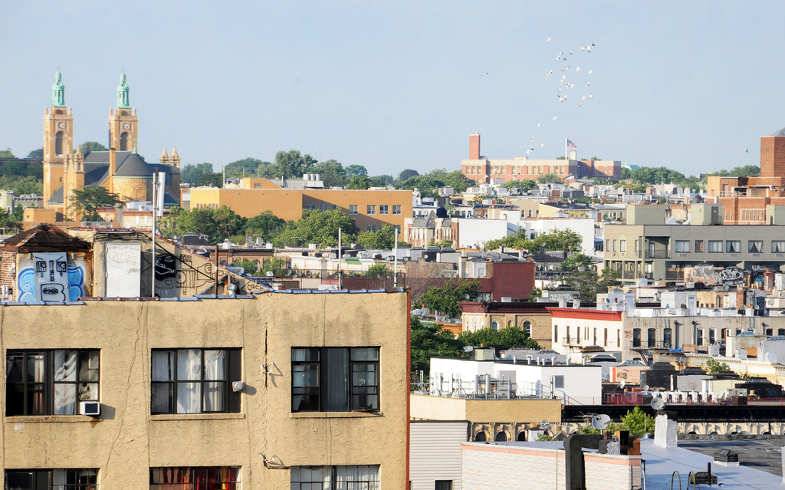

# Neighborhood Outline
[GeoJSON File](https://github.com/arv-ind/hc6/blob/master/map.geojson)

# Basic Demographics & Statistics
### Zip Code
11385
### Census Tract Codes
0613.01, 0581.00, 0593.00, 0595.00, 0587.00, 0585.00 
### Map & Photograph

### Neighborhood Demographics

##### Population
69,317
##### Population Density
59.9 inhabitants per acre

### Neighborhood Distances
##### To Federal Hall
11 miles
##### To Empire State Building
6.8 miles
# Station Usage Statistics

